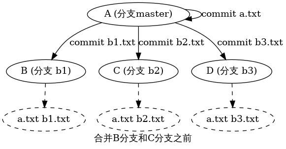
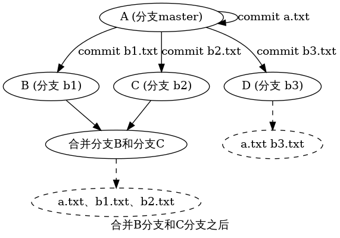

# 引言
之前自己做开发的时候，用的都是一些简单的Git命令，Clone，Pull，Push。现在要做协作开发了，需要更深入地理解了，故此记录一下自己的学习理解，这里记录的是对Git工具的一些个人的理解，不包括一些工具性的介绍命令。

# 单向有向图
我们开发的过程，主要都是不断commit、merge的过程，即不断从当前结点产生结点的过程，那么这些操作就构成了一张单向有向图，起始节点是master分支的第一个结点。

## 一个结点代表一个改动
Git的的Commit、Merge都会从当前分支上往前推进一个结点，代表着一次改动，这个改动的意义指：
- 增加
- 删除
- 修改
- ..

# Example

## 简介
这里用几个文件，并且提交后引入几个结点介绍一下

## A结点
master分支上的第一个结点，由我们提交文件a.txt后产生

## B、C、D分支
在提交a.txt文件后用git branch命令分别产生的三个分支B、C、D

## B、C、D结点
由我们分别在B、C、D分支上分别提交b1.txt、b2.txt、b3.txt文件产生的

如图所示

从A到B这条路径代表的软件版本是:a.txt b1.txt

从A到C这条路径代表的软件版本是:a.txt b2.txt

从A到D这条路径代表的软件版本是:a.txt b3.txt

# 合并B和C后

# 总结
所有的提交记录构成一个单向有向图，根节点开始到达当前结点的所有路径包含的所有结点（结点代表一个修改）代表着当前的版本。