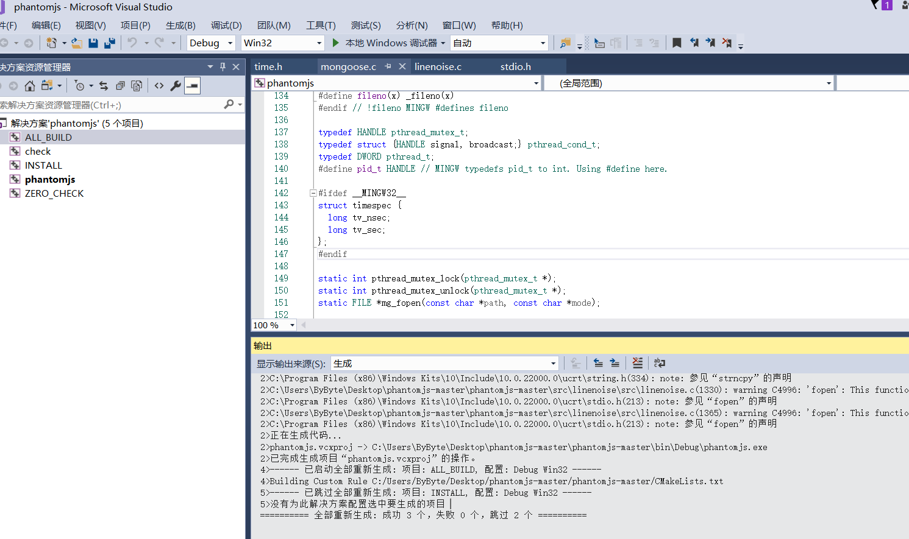
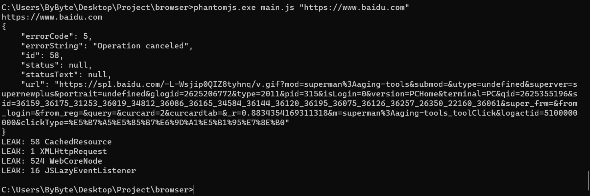

# 前言
最近需要用到PhantomJS做网页加载测试，确实测试出问题了，但不知道具体问题，所以需要调试一下，Linux下编译方便，但是Linux下好像没出现问题，所以需要在Window下编译。

# 需要的工具
- PhantomJs
- Visual Studio 2017
- Qt 5.14.0
- QtWebKit MSVC2017 X86
- CMake
- OpenSSL
## PhantomJS
我用的Commit版本是 [PhantomJs](https://github.com/ariya/phantomjs/tree/0a0b0facb16acfbabb7804822ecaf4f4b9dce3d2)

## Visual Studio 2017
这个可以直接去微软官网下，我也提供一个快捷门吧 [Visual Studio 2017](https://download.visualstudio.microsoft.com/download/pr/4dfffe3f-2a7e-4dea-922b-62d4beca5e36/ca4ebbc3bee27caa44ef91b21bc30837a028c23a046c009600038316e5976b5b/vs_Community.exe)

## Qt 5.14.0
我那个版本的PhantomJS要求的QT版本好像就是这个版本 [Qt 5.14.0](https://mirrors.tuna.tsinghua.edu.cn/qt/archive/qt/5.14/5.14.0/qt-opensource-windows-x86-5.14.0.exe)

## QtWebKit
光装Qt还不行，还需要加个[QtWebKit](https://github.com/qtwebkit/qtwebkit/releases) 版本选择MSVC17 x86的 下载完后添加到Qt安装目录对应的文件夹里

## CMake
这个直接到官网下载安装即可

## OpenSSL
我用的是[OpenSSL1.1.0](https://slproweb.com/download/Win32OpenSSL-1_1_1n.msi)

# 编译
## Step 1
在开始菜单里，打开Qt 5.14.0 (MSVC 2017 32-bit) 切换到代码目录
```shell
cd C:\Users\ByByte\Desktop\phantomjs-master
```

## Step2 
```shell
cmake .
```

## Step3
经过第二步后会产生一个sln文件,用VS2017打开编译即可，但是编译会出现几个问题，一个是库函数重定义，一个宏重定义问题，看着解决就行了



# 测试
main.js是我写的一个脚本，输入参数是网址，输出加载这个网站会出现的问题
```javascript
"use strict";
var page = require('webpage').create(),
    system = require('system'),
    address;

if (system.args.length === 1) {
    console.log('Usage: netlog.js <some URL>');
    phantom.exit(1);
} else {
    address = system.args[1];
    console.log(address)
    page.open(address, function (status) {
        if (status !== 'success') {
            console.log('FAIL to load the address');
        }
        phantom.exit();
    });
    page.onResourceError=function(res){
        console.log(JSON.stringify(res, undefined, 4))
    }
}
```
